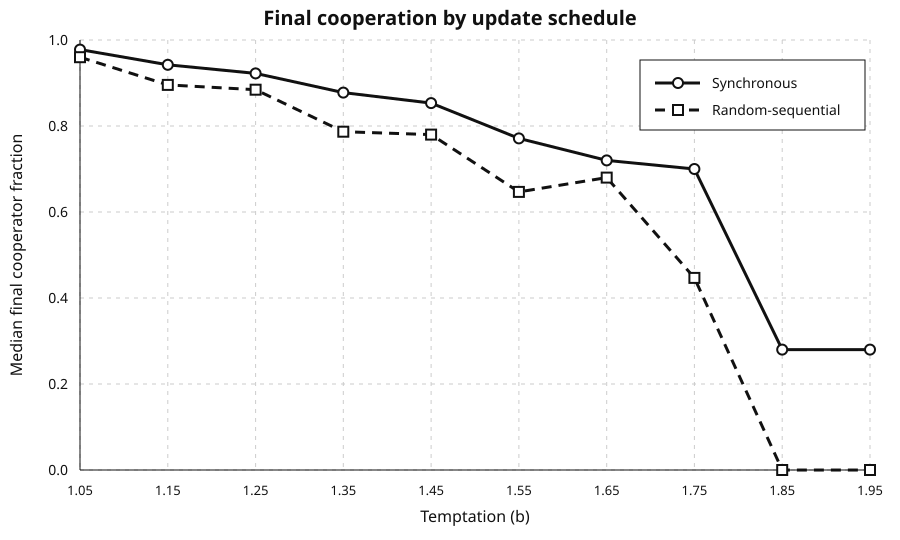

# Civitas Lab

[](https://github.com/luciegrillo/civitas-lab/actions/workflows/ci.yml)
[](LICENSE)

Reproducible experimental software for spatial evolutionary games, built in
modern Java.

Civitas Lab turns a versioned experiment configuration into deterministic
simulation runs, aggregate statistics, figures, snapshots, provenance, and a
SHA-256 manifest that can be validated independently. The published v0.1
baseline reproduces documented synchronous spatial Prisoner's Dilemma regimes
and includes a predeclared 1,200-run implementation-robustness study. The v0.2
development line adds explicit random-sequential scheduling and a paired
400-run scheduling-sensitivity study.

## Published Baseline

Civitas Lab `v0.1.1` provides:

- a dependency-free deterministic lattice engine;
- synchronous double-buffered updates with explicit tie semantics;
- bounded and toroidal Moore neighborhoods with optional self-interaction;
- stable seed derivation and paired initial conditions;
- strict, versioned JSON experiment configurations;
- parallel execution with deterministic output ordering;
- CSV, JSON, PNG, aggregate charts, provenance, and SHA-256 manifests;
- historical frequency-profile and kaleidoscope scenarios;
- a 1,200-run robustness study over model implementation choices.

Download the executable and complete experiment outputs from the
[v0.1.1 release](https://github.com/luciegrillo/civitas-lab/releases/tag/v0.1.1).

## Experiment Showcase

### Update-schedule sensitivity

The v0.2 development study compares synchronous generations with
random-sequential shuffled sweeps while pairing the initial lattice across both
conditions. It executes 400 runs over ten temptation values and reports
schedule-aware distributions rather than only means.



Within this bounded grid, random-sequential updating produces a lower median
final cooperator fraction at every tested temptation value. At `b=1.85` and
`b=1.95`, all random-sequential runs reach all-defect by tick 100, while 85% of
synchronous runs remain mixed.

See the predeclared [scheduling protocol](docs/scheduling-study-protocol.md) and
[scheduling results](docs/scheduling-results.md).

### v0.1 implementation robustness

The v0.1 robustness suite executes 1,200 runs across temptation, boundaries,
self-interaction, lattice sizes, and initial cooperator densities. It reports
means together with dispersion, quantiles, and absorbing-state rates so that
multimodal outcomes are not hidden behind one summary statistic.


At high temptation, removing self-interaction sharply reduces cooperation, and
low initial cooperator density produces a mixture of all-defect,
all-cooperate, and persistent mixed outcomes.


### Spatial kaleidoscope

A single central defector evolves inside a bounded `49×49` lattice of
cooperators while preserving horizontal and vertical reflection symmetry.

| Generation 20 | Generation 100 | Generation 179 |
|---|---|---|
|  |  |  |

### Frequency profile

A paired initial lattice is reused across twelve temptation values to expose
how the same starting condition produces different cooperation trajectories.


The complete configurations, compact tables, interpretation boundaries, and
reproduction commands are documented in the
[baseline results](docs/results.md),
[implementation robustness study](docs/robustness.md), and
[scheduling results](docs/scheduling-results.md).

## Scientific Scope

Civitas Lab is a focused laboratory for one documented family of binary spatial
evolutionary games. It verifies implementation rules and studies how selected
model choices affect simulation behavior.

| Implemented on the current development line | Planned, not yet implemented |
|---|---|
| Synchronous and random-sequential spatial Prisoner's Dilemma | General graph topologies |
| Bounded and toroidal square lattices | Other documented update mechanisms |
| Deterministic unconditional imitation | Reputation and assessment rules |
| Separate initialization and scheduling seeds | Public-goods and institutional models |
| Reproducible experiment and artifact pipeline | Polarization and information diffusion |

The current results support claims about the documented implementation and its
behavior under the tested configurations. They do not establish that spatial
structure universally promotes cooperation, that random-sequential updating
always reduces cooperation, or that the model predicts human societies.

## Why This Project Exists

Agent-based simulations can produce compelling patterns while hiding the
implementation choices that generated them. Civitas Lab makes those choices
explicit and testable: configurations, seeds, update semantics, runtime
metadata, and output checksums travel with each experiment.

The first release is deliberately narrow. It uses a published spatial game as
a validation target, exposes sensitivity to model choices, and establishes a
reproducible foundation for later scheduling and network experiments without
claiming to model real societies.

## Project Principles

- **Reproducible:** configurations, seeds, provenance, and checksums accompany
  experiment outputs.
- **Deterministic where specified:** each supported schedule is repeatable from
  its declared seeds and semantics.
- **Scientifically modest:** claims are limited to the implemented model and
  its documented assumptions.
- **Engineering-focused:** the mathematical core is isolated from CLI, storage,
  and visualization concerns.
- **Incremental:** new mechanisms are added only after the existing baseline is
  specified and verified.

## Quick Start

Civitas Lab requires Java 25. The Gradle Wrapper downloads the pinned build
tool automatically.

```bash
./gradlew build
java -jar app/build/libs/civitas-lab-0.1.1.jar \
  run configs/smoke.json \
  --output artifacts/smoke
java -jar app/build/libs/civitas-lab-0.1.1.jar \
  validate artifacts/smoke
```

A scheduling smoke comparison is available at
[`configs/scheduling-smoke.json`](configs/scheduling-smoke.json).

Each execution writes the resolved configuration, provenance, run-level time
series and snapshots, aggregate tables, charts, and a SHA-256 manifest.

See the [experiment format](docs/experiment-format.md) for the configuration
contract.

## Roadmap

The v0.2 development milestone now includes the scheduling engine, versioned
configuration, paired study, and compact results. Remaining release work
focuses on self-contained HTML reports, release validation, and archival
metadata before moving to graph topologies.

See the full [roadmap](docs/roadmap.md) for direction and release boundaries.

## Documentation

- [Scientific scope](docs/scientific-scope.md)
- [ODD model description](docs/model-odd.md)
- [Update schedules](docs/update-schedules.md)
- [Experiment protocol](docs/experiment-protocol.md)
- [Scheduling robustness protocol](docs/scheduling-study-protocol.md)
- [Architecture](docs/architecture.md)
- [Baseline results](docs/results.md)
- [Implementation robustness study](docs/robustness.md)
- [Scheduling robustness results](docs/scheduling-results.md)
- [Limitations and claim boundaries](docs/limitations.md)
- [References](docs/references.md)
- [Roadmap](docs/roadmap.md)

## License

Licensed under the [Apache License 2.0](LICENSE).
