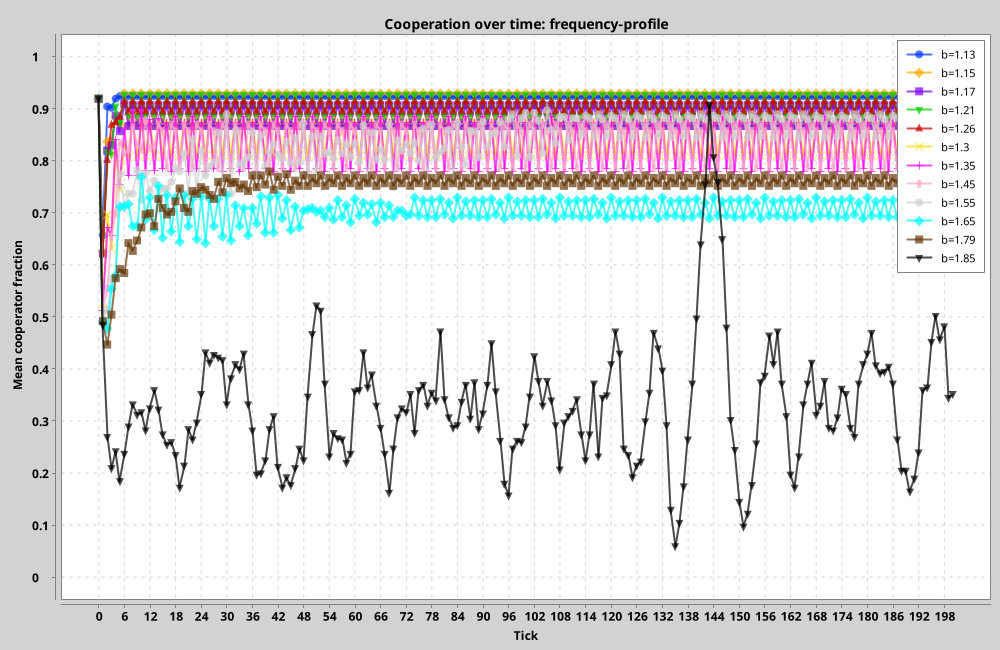
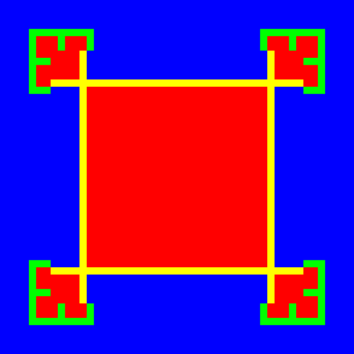
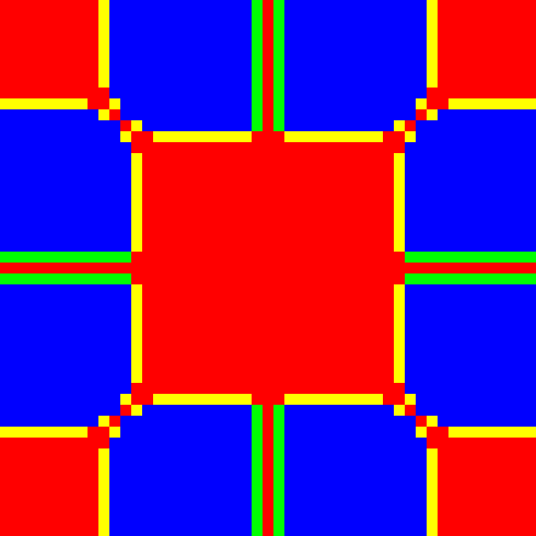
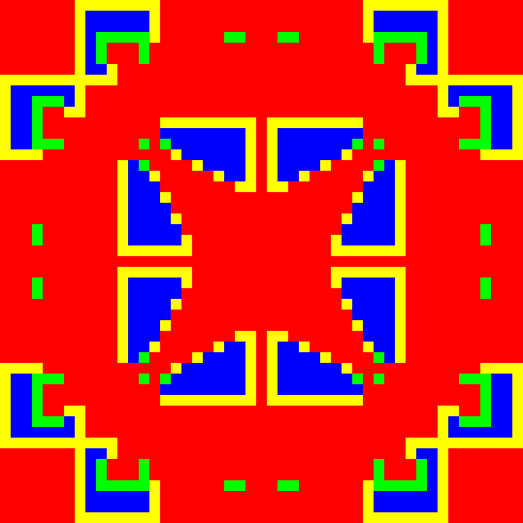

# v0.1 Baseline Results

## Interpretation Boundary

These results verify Civitas Lab against one documented spatial evolutionary
game. They do not show that spatial structure universally causes cooperation
or that the model predicts human behavior.

The original papers do not publish every implementation detail or the exact
random initial lattice. Civitas Lab therefore reproduces the stated rules and
qualitative regimes with a documented seed; it does not claim pixel identity
with historical figures.

## Frequency Profile

The frequency experiment uses one paired Bernoulli lattice with
`p(C)=0.9` across twelve temptation values on a `20×20` torus. Each run lasts
200 synchronous generations.



The selected seed produces persistent mixed populations throughout the sweep.
Final cooperation remains above `0.84` through `b=1.55`, falls to `0.73` at
`b=1.65`, and reaches `0.35` at `b=1.85`. The trajectory at `b=1.85` is highly
variable, illustrating why a single historical profile must not be treated as
an uncertainty estimate.

The compact numerical output is available in
[`frequency-aggregate.csv`](results/v0.1/frequency-aggregate.csv).

## Kaleidoscope

The kaleidoscope experiment starts with one central defector in a `49×49`
bounded lattice of cooperators, uses `b=1.85`, and runs through generation 179.

| Generation 20 | Generation 100 | Generation 179 |
|---|---|---|
|  |  |  |

The dynamics preserve horizontal and vertical reflection symmetry while
forming changing spatial domains. At generation 179, the cooperator fraction
is approximately `0.282`; over generations 130–179, its mean is approximately
`0.293`.

The final raw lattice has an internal SHA-256 regression hash of
`3a58ca068761e6eca6fcd918cd08c2c4db467c5bac8f38e6d83d36b838a94df5`.
This hash protects Civitas Lab against accidental implementation changes. It
is not presented as a hash of a published historical lattice.

## Reproduction

```bash
java -jar app/build/libs/civitas-lab-0.1.0.jar \
  run configs/nowak-may-frequency.json \
  --output artifacts/frequency

java -jar app/build/libs/civitas-lab-0.1.0.jar \
  run configs/nowak-may-kaleidoscope.json \
  --output artifacts/kaleidoscope
```
