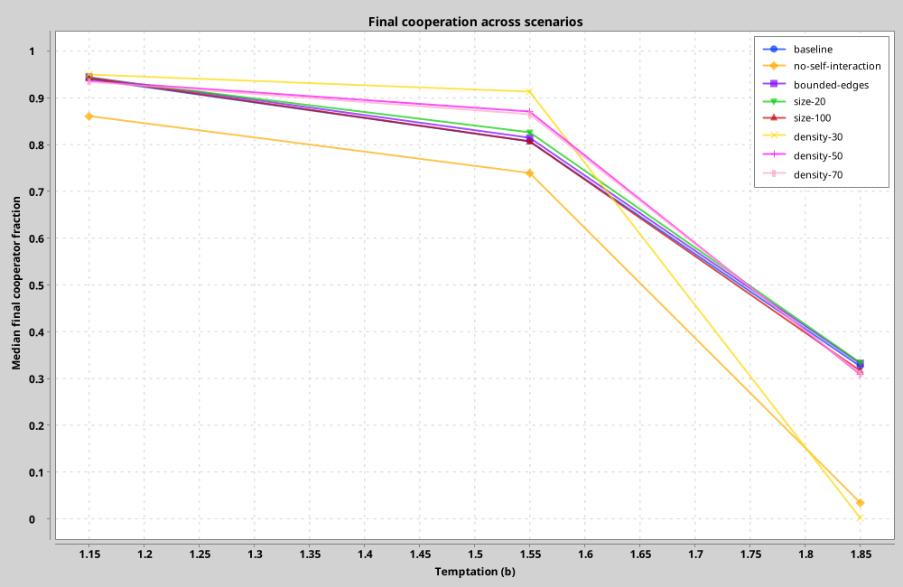
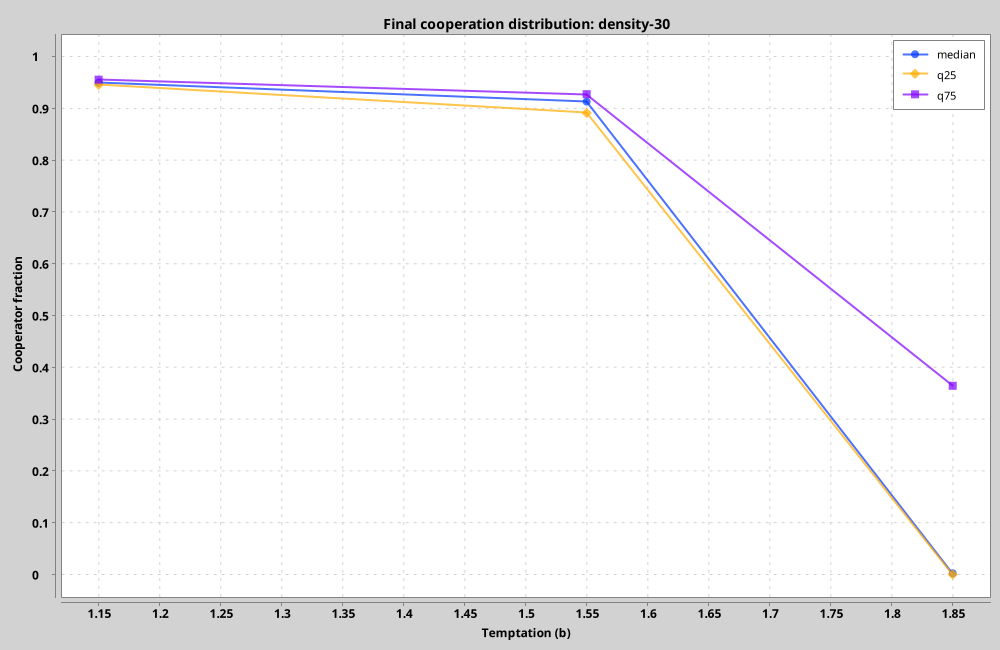

# v0.1 Robustness Study

## Design

The v0.1 robustness suite varies one synchronous-model choice at a time around
this baseline:

- `50×50` toroidal lattice;
- self-interaction enabled;
- Bernoulli initialization with `p(C)=0.9`;
- temptation values `b ∈ {1.15, 1.55, 1.85}`;
- 50 paired replicates per temptation;
- 200 generations, measuring generations 151–200.

Alternatives remove self-interaction, use bounded edges, change the lattice to
`20×20` or `100×100`, or change initial cooperation to `0.3`, `0.5`, or `0.7`.
This produces 1,200 runs and approximately 762 million site updates.

The same master seed, seed group, and replicate index are used across variants.
This pairs initial random streams while every simulation remains independent.

## Results

Most variants preserve the broad ordering across temptation values, but two
mechanisms materially alter the high-temptation regime:

- Removing self-interaction reduces the median final cooperator fraction at
  `b=1.85` from `0.327` to `0.034`.
- Starting from `p(C)=0.3` produces a strongly multimodal outcome at `b=1.85`.
  Of 50 runs, 42% end in all-defection, 10% in all-cooperation, and 48% in a
  mixed state. The final median is `0.002`, while the 95th percentile is `1.0`.

Lattice size primarily changes dispersion in this tested range. At `b=1.85`,
the `20×20` variant has a final interquartile range of approximately
`0.286–0.416`, compared with `0.304–0.327` for `100×100`.

The complete compact table is available in
[`robustness-aggregate.csv`](results/v0.1/robustness-aggregate.csv).

## Interpretation

These are descriptive results for a predeclared, bounded robustness grid.
Fifty replicates were chosen as a practical exploratory budget, not as a
universal Monte Carlo rule. No inferential claim should rely only on a mean:
absorbing-state rates and quantiles are reported because some outcomes are
multimodal and path-dependent.

The suite deliberately excludes asynchronous updates. Scheduling robustness is
the subject of the planned v0.2 model.

## Performance Observation

On the development machine, the full suite completed in approximately
10.35 seconds, including run-level CSV/JSON output and chart generation. This
corresponds to roughly 73 million site updates per second for this workload.
The value is descriptive and is not enforced as a hardware-dependent CI gate.
